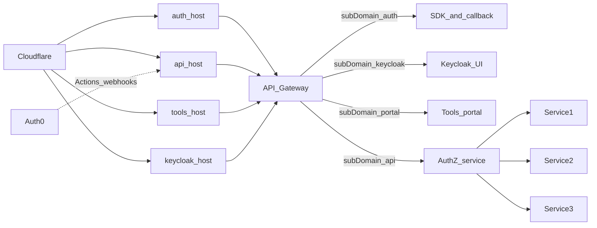

# Architecture

This POC separates authentication and authorization concerns. For **browser flows, public hostnames, and production edge** (Cloudflare, DNS, Host allowlist), read **Edge and DNS** and **Request flow** below. Step-by-step login and token behavior remain in [auth-flow.md](./auth-flow.md).

## Components

- `frontend`: calls gateway endpoints.
- `api-gateway`: authentication validation, routing, static SDK, OAuth callback, optional **public Host allowlist**.
- `keycloak-api`: Auth0 / Keycloak token and user sync (see [key-cloak-server-docs.md](./key-cloak-server-docs.md)).
- `authz-service`: RBAC and dashboard policy over MySQL.
- `mock-service`: sample proxied admin/user APIs.

## Edge and DNS (production)

Traffic enters **Cloudflare** (WAF, TLS, DDoS) then the same origin load balances to **one api-gateway** process. The gateway can route by **public hostname** (conceptually `subDomain`: `auth`, `api`, `tools`, `keycloak`) in addition to path-based routes in code.

### Keycloak public entry (decision)

Use a **fourth DNS name** in Cloudflare, e.g. **`keycloak.iabtechlab.ai`**, pointing at the **same gateway origin** (or the same LB in front of it) as `auth`, `api`, and `tools`. That matches a `subDomain = keycloak` route without an unnamed entry on the diagram.

**TLS:** Cover all public names on the certificate presented at the edge (Cloudflare) and, if you use **full (strict)** origin SSL, on the origin cert or tunnel config.

**Alternative:** Expose Keycloak only under a **path prefix** on `api.*` or `tools.*` (ingress path routing). Then update **redirect URIs**, **KC hostname** settings, and documentation so nothing assumes a dedicated `keycloak` host.

### Public hostname responsibilities

| Host (example) | Responsibility |
|----------------|----------------|
| **auth.*** | **Static SDK** (`/sdk/v1/...`), **OAuth authorization-code callback** (`/callback`), and **redirects** to the SPA (`FRONTEND_URL` / hash tokens). Register Auth0 **Allowed Callback URLs** on this origin (including `APP_BASE_PATH` if used). |
| **api.*** | **JSON APIs**, **JWT validation**, **Auth0 Actions webhooks** (`POST /webhooks/auth0/*` via `BACKEND_URL`), **proxy to keycloak-api** for `/login`, `/signup`, `/auth/kc-password*`. |
| **tools.*** | **Tools portal** (SPA or proxied frontend). |
| **keycloak.*** | **Keycloak account / realm UIs** when proxied through the gateway, or browser traffic to Keycloak’s HTTP port when routed by ingress (keep issuer and cookie scope explicit in either case). |

Cookies: if you introduce **HttpOnly session cookies** on the auth host, scope them to that host (or documented parent domain) and document **SameSite** needs for cross-subdomain flows.

## Request flow (edge)

**IdPs:** Auth0 and Keycloak issue tokens validated by the gateway (see [auth-flow.md](./auth-flow.md)). The dashed line reminds operators that **Auth0 Actions** must call a **public** `api.*` (or single gateway) URL.

## Host allowlist (api-gateway)

When **`GATEWAY_ALLOWED_HOSTS`** is set (comma-separated hostnames, case-insensitive), the gateway returns **403** for requests whose **`Host`** hostname is not listed. **`GET /health`** is mounted **before** this middleware and remains usable for probes (use an allowed `Host` header in production probes when the allowlist is on).

Set **`GATEWAY_TRUST_PROXY=1`** (or a hop count) when the TCP peer is a reverse proxy so **`req.hostname`** reflects the client-facing name (`X-Forwarded-Host` / `Forwarded` behavior per Express).

If the gateway is reachable **without** Cloudflare or your proxy, **Host** spoofing can bypass hostname-based security; treat the allowlist as **defense in depth** with network controls so only the edge can reach the process.

## AuthZ: PDP vs PEP in this repository

- **PDP (Policy Decision Point):** `authz-service` answers **allow/deny** (`/authz/check`) and returns **roles, permissions, dashboard** JSON. The gateway resolves the internal user id and calls AuthZ over HTTP.
- **PEP (Policy Enforcement Point):** The **api-gateway** validates JWTs, calls AuthZ where required, and **proxies** some traffic (e.g. mock admin/user APIs) to upstream services. **Not all bytes** pass through `authz-service`; AuthZ is not a generic TCP/HTTP proxy for Service1–3 in the current code.

If you evolve to **routing all API traffic through AuthZ** as a proxy, plan for **added latency**, **large uploads/downloads**, and **WebSockets** (today’s gateway↔AuthZ pattern is request/response JSON, not a streaming proxy).

## Operational resilience

- **Blast radius:** One gateway handles every hostname; mitigate with **per-hostname WAF/rate limit rules** in Cloudflare and **per-route limits** on the gateway where applicable.
- **Keycloak admin console:** Do not treat it like anonymous public API traffic; see [Keycloak Admin Console (production hardening)](./key-cloak-server-docs.md#keycloak-admin-console-production-hardening).

## Trust boundaries

- Frontend is untrusted.
- JWT claims are trusted only after cryptographic verification.
- Roles are not taken from JWT; permissions are resolved from the AuthZ database.
