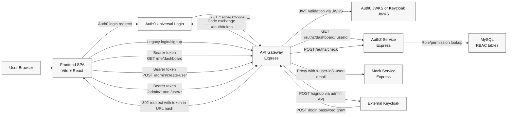
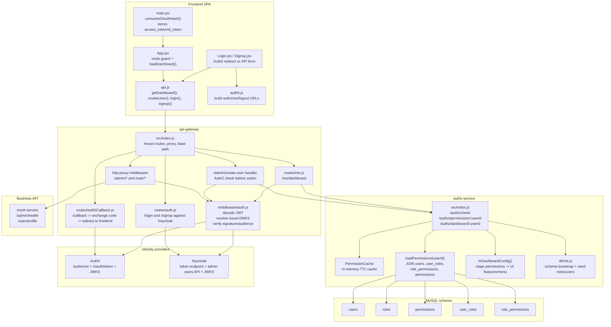
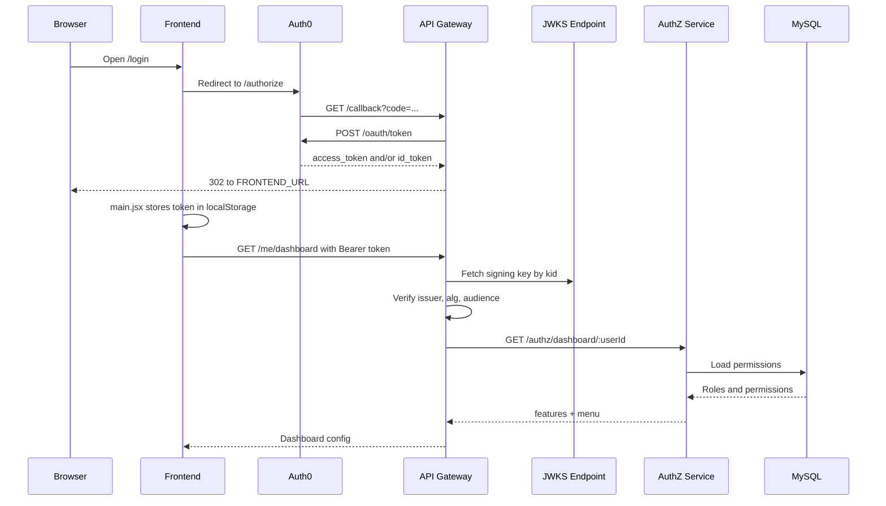
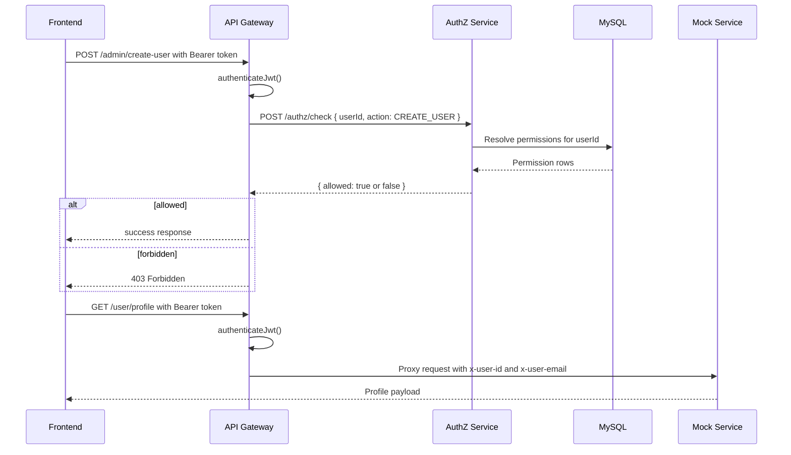

# HLD and LLD

This document reflects how the project is wired today by reading the code in `frontend`, `api-gateway`, `authz-service`, `mock-service`, and the repo docs.

## HLD

### HLD notes

- The frontend is only a presentation layer and token holder. It does not make authorization decisions final.
- The API gateway is the enforcement edge. It handles OAuth callback, legacy Keycloak login/signup, JWT verification, and routing.
- The AuthZ service is the source of truth for roles, permissions, and dashboard feature flags.
- MySQL stores RBAC data only. Credentials stay in Auth0 or Keycloak.
- The mock service behaves like a downstream business API that trusts the gateway to authenticate requests and forward identity headers.

## LLD

## Runtime flows

### 1. Auth0 login flow

### 2. Protected admin action flow

## Important implementation detail

- The docs describe AuthZ identity linkage as `users.id = JWT sub`.
- The current gateway code sets `req.user.userId` from `verified.email`, not `verified.sub`, in [api-gateway/src/middleware/auth.js](/Users/dev/Documents/Github/Kodescan/keycloak-poc/api-gateway/src/middleware/auth.js#L209).
- That means the live request path currently asks AuthZ for dashboard and permission data by email-shaped user ID, while the seeded demo data in [authz-service/src/db/init.js](/Users/dev/Documents/Github/Kodescan/keycloak-poc/authz-service/src/db/init.js#L31) uses fixed IDs like `demo-admin-sub`.
- If you want, I can do the next pass and align the implementation with the intended `sub`-based model so the diagrams and code match exactly.
