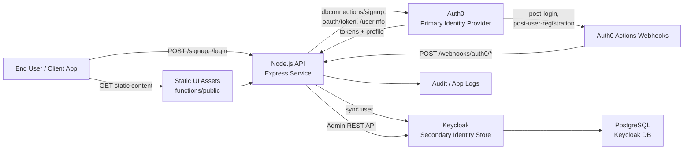
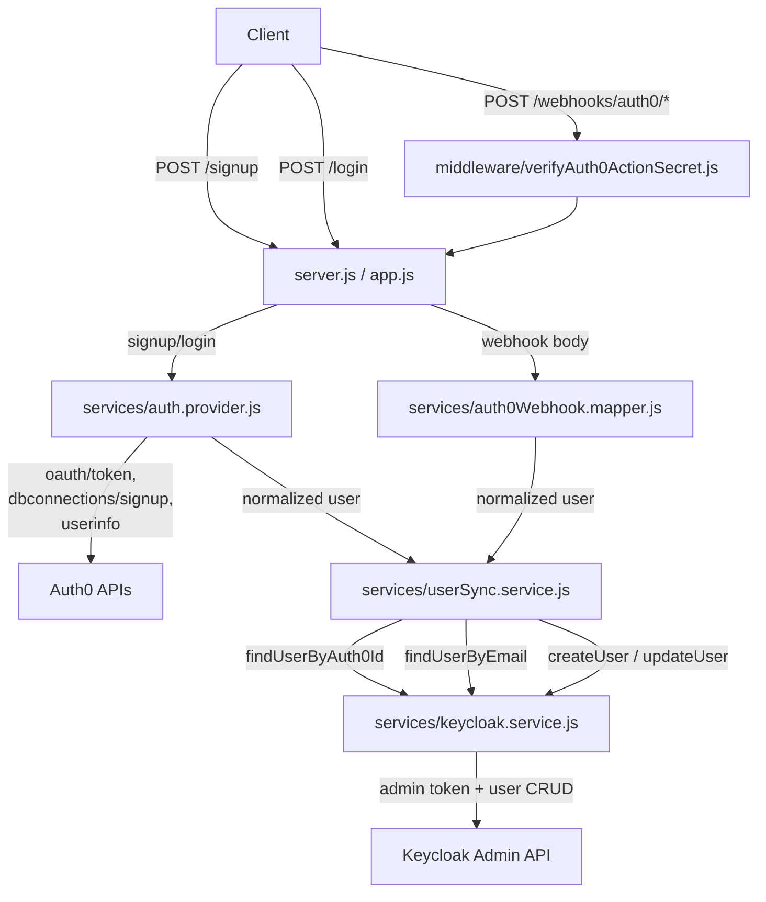

# Architecture Overview

This project is a Node.js/Express service that uses Auth0 as the primary identity provider and synchronizes users into Keycloak as a secondary identity store.

## What Is Running

- `functions/server.js` is the active entrypoint used by Docker and the local `npm start` script.
- `functions/app.js` is a more feature-rich HTTPS variant with GDPR-focused endpoints, rate limiting, static assets, and audit logging.
- `functions/routes/auth0Webhooks.js` receives Auth0 Action webhooks and triggers fail-open synchronization into Keycloak.
- `functions/services/auth.provider.js` handles Auth0 signup/login and resolves the Auth0 user profile from `/userinfo`.
- `functions/services/userSync.service.js` contains the sync decision logic for create vs update in Keycloak.
- `functions/services/keycloak.service.js` wraps Keycloak Admin API calls.

## HLD

### HLD Notes

- Auth0 is the source of truth for signup and login.
- Keycloak is kept aligned by either:
  - inline sync after `/signup` and `/login`
  - webhook-triggered sync from Auth0 Actions
- Keycloak persists its realm and user data in PostgreSQL when run through Docker Compose.
- The Node service can run standalone, in Docker, or as Firebase Functions source code, although the current runtime wiring is centered around the Express server.

## LLD

### LLD Flow

1. Client calls `/signup` or `/login`.
2. `auth.provider.js` talks to Auth0 and returns tokens plus a normalized user profile.
3. `userSync.service.js` decides whether the user already exists in Keycloak:
   - match by `auth0_id`
   - otherwise match by email
   - otherwise create a new Keycloak user
4. `keycloak.service.js` gets an admin token and performs the required Keycloak Admin API operation.
5. Auth0 webhooks follow a parallel path:
   - bearer token is validated by `verifyAuth0ActionSecret.js`
   - payload is normalized by `auth0Webhook.mapper.js`
   - sync runs in fail-open mode, so webhook failures do not block Auth0

## Runtime Endpoints

### Active in `server.js`

- `GET /health`
- `POST /signup`
- `POST /login`
- `POST /webhooks/auth0/pre-user-registration`
- `POST /webhooks/auth0/post-user-registration`
- `POST /webhooks/auth0/post-login`

### Extra in `app.js`

- all of the above, plus:
- `GET /user/export/:username`
- `PUT /user/update/:username`
- `DELETE /user/delete/:username`
- `POST /user/consent/revoke/:username`

## Data Model And Infra Notes

- The `models/` folder contains Mongoose schemas for meetings, companies, and users, but those models are not currently wired into the authentication flow.
- `cloudbuild.yaml` appears to come from a different deployment lineage and references `meeting-analytics-*` workspace names.
- `firebase.json` points at `functions/`, but the repo currently behaves more like a containerized Express service than a typical Firebase Functions codebase.

## Recommended Mental Model

- Primary auth path: `Client -> Express API -> Auth0`
- Sync path: `Express API -> userSync.service -> Keycloak Admin API`
- Webhook path: `Auth0 Action -> /webhooks/auth0/* -> mapper -> userSync.service -> Keycloak`
- Persistence path: `Keycloak -> PostgreSQL`
