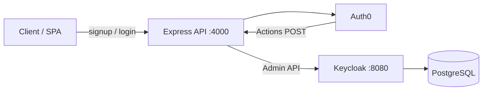

# Keycloak–Auth0 POC — Project Documentation

> **Monorepo:** implement this API as the **`keycloak-api/`** package in `tl-keycloak` (not the legacy `functions/` paths below). Behavior matches this document.

This repository is a **proof-of-concept Node.js (Express) API** that uses **Auth0** as the primary identity provider for signup and login, and **synchronizes users into Keycloak** via the Keycloak Admin REST API. Optional **Auth0 Actions** call webhook endpoints so users created or signing in through other Auth0 flows also appear in Keycloak.

For high-level and low-level architecture diagrams, see [architecture.md](./architecture.md).

---

## Table of contents

1. [Goals and scope](#goals-and-scope)
2. [Repository layout](#repository-layout)
3. [Runtime components](#runtime-components)
4. [Prerequisites](#prerequisites)
5. [Configuration (environment variables)](#configuration-environment-variables)
6. [Local development](#local-development)
7. [Docker Compose (PostgreSQL + Keycloak + API)](#docker-compose-postgresql--keycloak--api)
8. [HTTP API reference](#http-api-reference)
9. [Auth0 setup](#auth0-setup)
10. [Keycloak sync behavior](#keycloak-sync-behavior)
11. [Alternative entrypoint: `app.js` (HTTPS + GDPR)](#alternative-entrypoint-appjs-https--gdpr)
12. [Deployment notes](#deployment-notes)
13. [Security considerations](#security-considerations)
14. [Troubleshooting](#troubleshooting)

---

## Goals and scope

| In scope | Out of scope / not wired |
|----------|---------------------------|
| Auth0 Resource Owner Password flow for login | Production-grade secret management |
| Auth0 Database Connections signup API | Mongoose models in `functions/models/` (not used in auth flow) |
| User create/update in Keycloak with `auth0_id` attribute | Bidirectional sync (Keycloak → Auth0) |
| Webhooks from Auth0 Actions (Bearer secret) | Automated tests (npm `test` is a placeholder) |

**Mental model:** Auth0 is the **source of truth** for authentication. Keycloak is a **secondary store** kept aligned for demos, federation experiments, or downstream OIDC clients.

---

## Repository layout

| Path | Purpose |
|------|---------|
| `functions/server.js` | **Default entrypoint** — HTTP Express app (`npm start`, Docker `CMD`). |
| `functions/app.js` | Optional HTTPS server with helmet, rate limits, static files, GDPR-style user endpoints; expects TLS certs at `/etc/ssl/selfsigned/`. |
| `functions/services/auth.provider.js` | Auth0 signup (`/dbconnections/signup`), login (`/oauth/token`), profile (`/userinfo`). |
| `functions/services/keycloak.service.js` | Admin token + Keycloak user search/create/update. |
| `functions/services/userSync.service.js` | Decide create vs update; map Auth0 user → Keycloak payload. |
| `functions/routes/auth0Webhooks.js` | `/webhooks/auth0/*` routes; fail-open sync for post-registration/post-login. |
| `functions/middleware/verifyAuth0ActionSecret.js` | Validates `Authorization: Bearer <AUTH0_ACTIONS_SECRET>`. |
| `functions/services/auth0Webhook.mapper.js` | Normalizes Action payloads to `{ auth0_id, email, name, email_verified }`. |
| `functions/auth0-actions/actions-for-auth0-dashboard.js` | Copy-paste handlers for Auth0 Dashboard Actions (pre/post registration, post-login). |
| `functions/docker-compose.yml` | Postgres 15, Keycloak 25, API image. |
| `functions/Dockerfile` | Node 22 Alpine; runs `node server.js`. |
| `firebase.json` | Declares `functions/` as Firebase Functions source; **current runtime is Express/Docker-centric**. |
| `cloudbuild.yaml` | References another project lineage (`meeting-analytics-*`); treat as **historical / not aligned** with this POC unless you rewire it. |

---

## Runtime components



- **API:** Express 5, CORS open to `*`, JSON body parser.
- **Keycloak:** Realm and users persisted in PostgreSQL when using Compose.
- **Webhooks:** Auth0 Actions POST JSON with a shared secret; sync errors return HTTP 200 with `keycloakSync: "failed"` so Auth0 flows are not blocked (fail-open).

---

## Prerequisites

- **Node.js** (project uses Node 22 in Docker; local Node 18+ should work).
- **Auth0** tenant with a Database Connection and an application (client) with **client secret** enabled for the Resource Owner Password grant where your tenant policy allows it.
- **Keycloak** reachable from the API (local, Docker network, or remote URL in `KEYCLOAK_BASE_URL`).

---

## Configuration (environment variables)

Copy `functions/.env.example` to `functions/.env` and set values. Below is a consolidated reference.

### API

| Variable | Description |
|----------|-------------|
| `PORT` | Listen port (default `4000`). |
| `API_PORT` | Host port mapped in Docker Compose (default `4000`). |
| `NODE_ENV` | e.g. `development` / `production`. |

### Keycloak (sync service)

The sync code uses **`KEYCLOAK_BASE_URL`** and **`KEYCLOAK_REALM`** (see `keycloak.service.js`). Do not set `KEYCLOAK_CLIENT_ID` to the realm name `master` when using optional client-credentials mode.

| Variable | Description |
|----------|-------------|
| `KEYCLOAK_BASE_URL` / `KEYCLOAK_URL` | Base URL (no trailing path). In Compose, overridden to `http://keycloak:8080` for the API container. |
| `KEYCLOAK_REALM` | Realm name (e.g. `master` for stock dev). |
| `KC_ADMIN_USERNAME` / `KC_ADMIN_PASSWORD` | Keycloak admin user for **password grant** with `admin-cli` (default pattern). |
| `KC_ADMIN_CLIENT_ID` | Default `admin-cli`. |
| `KEYCLOAK_USE_CLIENT_CREDENTIALS` | Set to `true` to use `client_credentials` with `KEYCLOAK_CLIENT_ID` / `KEYCLOAK_CLIENT_SECRET`. |
| `KC_HOSTNAME` | Used by Keycloak container for links/proxy (see `docker-compose.yml`). |

### Auth0 (API)

| Variable | Description |
|----------|-------------|
| `AUTH0_DOMAIN` | Tenant domain (with or without `https://`). |
| `AUTH0_CLIENT_ID` / `AUTH0_CLIENT_SECRET` | Application credentials. |
| `AUTH0_AUDIENCE` | Optional API audience for `/oauth/token`. |
| `AUTH0_CONNECTION` | DB connection name (default `Username-Password-Authentication`). |
| `AUTH0_SCOPE` | Default `openid profile email`. |

### Auth0 Actions (webhooks)

| Variable | Description |
|----------|-------------|
| `AUTH0_ACTIONS_SECRET` | Must match the Action secret (e.g. `ACTIONS_SECRET`) — sent as `Authorization: Bearer …`. If unset, webhooks return **503**. |
| `BACKEND_PUBLIC_URL` | Documented in `.env.example` as the public base URL Auth0 can reach (ngrok/cloud); align with Action secret `BACKEND_URL`. |

---

## Local development

```bash
cd functions
cp .env.example .env
# Edit .env with Auth0 and Keycloak URLs

npm ci
npm start
# or: npm run dev   # nodemon server.js
```

Ensure Keycloak is running and admin credentials match `KC_ADMIN_*`. The API listens on `http://localhost:${PORT:-4000}`.

**CSS (optional):** `npm run build:css` builds Tailwind output to `public/css/output.css` if you use the static UI in `app.js`.

---

## Docker Compose (PostgreSQL + Keycloak + API)

From `functions/`:

```bash
cp .env.example .env
# Set AUTH0_* and AUTH0_ACTIONS_SECRET; review KEYCLOAK_* for host vs container

docker compose up --build -d
```

- **Postgres:** data under `functions/data/postgres` on the host.
- **Keycloak:** image `quay.io/keycloak/keycloak:25.0.6`, HTTP on host port `8080`, uses Docker volume `keycloak_data`.
- **API:** build from `Dockerfile`, exposes `${API_PORT:-4000}` → container `4000`, healthcheck `GET /health`.

Compose sets `KEYCLOAK_URL` / `KEYCLOAK_BASE_URL` to `http://keycloak:8080` for the API service so in-container resolution works even if `.env` still says `localhost`.

---

## HTTP API reference

Base URL: `http://localhost:4000` (or your deployed host). All JSON bodies use `Content-Type: application/json` unless noted.

### `GET /health`

Returns `{ "status": "ok" }`. Used for load balancers and Compose healthchecks.

### `POST /signup`

**`server.js` body:**

```json
{ "username": "string", "email": "user@example.com", "password": "string" }
```

**Flow:** `auth.provider.signup` → Auth0 `dbconnections/signup` → login with **email** as username → `/userinfo` → async `syncUserToKeycloak` (errors logged, signup still succeeds).

**Response:** `{ "message": "User created successfully" }` on success.

**`app.js` variant:** also requires `"consent": true` (boolean); validates with express-validator; returns `400` if consent missing.

### `POST /login`

**Body:**

```json
{ "username": "email-or-username", "password": "string" }
```

**Note:** After signup, the code logs in using **email** as the username; for manual login, use the same identifier Auth0 expects for the password grant (often email for DB connections).

**Response:** Token response from Auth0 `/oauth/token` **or** Keycloak’s token endpoint when the user exists in Keycloak with a local password (see **Keycloak-first login** below). The JSON shape matches OIDC (`access_token`, `token_type`, etc.).

**Keycloak-first login:** If a Keycloak user is found for the same email/username **and** that user has a password credential (or `kc_password_enrolled=true`), the API authenticates with Keycloak only (Resource Owner Password grant) using `KEYCLOAK_ROPG_CLIENT_ID` and returns Keycloak tokens — **Auth0 is not called**. Otherwise the request falls back to Auth0 ROPG as before.

**Errors:** `401` with `{ "error": "Incorrect password" }` on invalid credentials; `501` from Keycloak path if `KEYCLOAK_ROPG_CLIENT_ID` is unset (falls back to Auth0).

### `GET /auth/kc-password-status`

**Auth:** `Authorization: Bearer <Auth0 access_token>` (RS256 JWT from Auth0).

**Response:**

```json
{
  "needsPassword": true,
  "keycloakUserId": "uuid-or-null",
  "keycloakUserMissing": false,
  "deadlineIso": "2026-05-19T12:00:00.000Z",
  "daysRemaining": 30,
  "deadlinePassed": false
}
```

`needsPassword` is **true** when the Keycloak user has no `password` credential and `kc_password_enrolled` is not set. If the user has not been synced to Keycloak yet, `keycloakUserMissing` is **true** and `keycloakUserId` may be null; in that case `deadlineIso` / `daysRemaining` / `deadlinePassed` are null or false as appropriate. When `needsPassword` is true and a Keycloak user exists, the first successful status check sets **`kc_password_deadline`** on the user (30 days ahead) if missing, and returns **`deadlineIso`**, whole-day **`daysRemaining`**, and **`deadlinePassed`**.

### `POST /auth/kc-password`

**Auth:** `Authorization: Bearer <Auth0 access_token>`.

**Body:** `{ "password": "…", "passwordConfirm": "…" }` (min length 8; values must match).

**Behavior:** Keycloak Admin API `reset-password` for the synced user, then user attribute `kc_password_enrolled=true`, and **`kc_password_deadline`** is removed if present.

**Response:** `{ "ok": true, "message": "keycloak_password_set" }` on success.

**Note:** In production, expose these routes via **api-gateway** (same paths under the gateway origin) and apply **rate limiting** on `POST /auth/kc-password`.

### Canonical user id (authz-service)

After a successful **Auth0** login, **keycloak-api** calls **authz-service** `POST /authz/identities/ensure` and receives a stable internal UUID. That id is written to Keycloak as user attribute **`app_user_id`**. After a **Keycloak** login, the API calls `POST /authz/identities/link` so the Keycloak `sub` maps to the **same** internal id. **api-gateway** resolves JWTs to this internal id for `GET /me/dashboard` → `GET /authz/dashboard/:userId`.

### Webhooks (all require `Authorization: Bearer <AUTH0_ACTIONS_SECRET>`)

Mounted under `/webhooks/auth0` (see `routes/auth0Webhooks.js`).

| Method | Path | Behavior |
|--------|------|----------|
| POST | `/webhooks/auth0/pre-user-registration` | Validates email present; **does not** sync to Keycloak; `400` if email missing. |
| POST | `/webhooks/auth0/post-user-registration` | Maps payload → sync user; fail-open on Keycloak errors. |
| POST | `/webhooks/auth0/post-login` | Same as post-registration. |

**Success responses** typically include `ok: true`. Keycloak sync may return `keycloakSync: "ok" | "skipped" | "failed"`. Invalid/mappable payload yields `keycloakSync: "skipped", reason: "invalid_payload"`.

### Extra endpoints only in `app.js`

| Method | Path | Purpose |
|--------|------|---------|
| GET | `/user/export/:username` | JSON export of Keycloak user data (attributes, roles, groups, events, …). |
| PUT | `/user/update/:username` | Update email / first / last name. |
| DELETE | `/user/delete/:username` | Delete Keycloak user. |
| POST | `/user/consent/revoke/:username` | Sets `gdpr_consent` user attribute. |

Static files are served from `functions/public/`. Server listens with **HTTPS** on `0.0.0.0:PORT` and requires cert files at `/etc/ssl/selfsigned/`.

---

## Auth0 setup

1. **Application:** Create a Regular Web / SPA / Native app as appropriate; obtain **Client ID** and **Client Secret**.
2. **Grant types:** Enable **Password** (Resource Owner Password) if you use `/login` and signup’s internal login — subject to Auth0 product/tenant rules.
3. **Database connection:** Ensure `AUTH0_CONNECTION` matches the connection name in the dashboard.
4. **Actions:** Use `functions/auth0-actions/actions-for-auth0-dashboard.js`. For each Action:
   - Add secrets **`BACKEND_URL`** (public API base, no trailing slash) and **`ACTIONS_SECRET`** (same string as `AUTH0_ACTIONS_SECRET` on the server).
   - Deploy the Action on the correct flow (Pre User Registration, Post User Registration, Post Login).

**Local webhooks:** Auth0 cloud cannot call `http://localhost`; use a tunnel (ngrok, Cloudflare Tunnel, etc.) and set `BACKEND_URL` / `BACKEND_PUBLIC_URL` accordingly.

---

## Keycloak sync behavior

Implemented in `userSync.service.js` + `keycloak.service.js`.

1. **Normalize user:** `auth0_id`, `email`, `name`, `email_verified`.
2. **Find by `auth0_id`:** User attribute `auth0_id` in Keycloak (search uses `q=auth0_id:…` with fallback scan).
3. **Else find by email** (case-insensitive).
4. **Else create** user with username derived from email (or name), `attributes.auth0_id`, `last_synced_at`.

Admin API authentication defaults to **password grant** on realm `${KEYCLOAK_REALM}` with client `KC_ADMIN_CLIENT_ID` (`admin-cli`). Optional **client credentials** for a confidential client with appropriate realm-management roles.

---

## Alternative entrypoint: `app.js` (HTTPS + GDPR)

- **Not** used by `npm start` or the Dockerfile.
- Run manually only if you supply TLS materials and accept duplicated route definitions for `/signup`, `/login`, `/health`, webhooks.
- Adds Winston audit logging to `LOG_PATH` (default `./logs/audit.log`), stricter validation, and GDPR-oriented routes listed above.

---

## Deployment notes

- **Docker:** `functions/Dockerfile` is the supported container image for the API.
- **Firebase:** `firebase.json` points at `functions/`, but there is no `functions/index.js` export for Cloud Functions in this POC; deploying would require additional Firebase wiring.
- **Cloud Build:** `cloudbuild.yaml` clones a different workspace name and deploys Firebase functions — verify before reuse.

---

## Security considerations

- **Secrets:** Never commit `.env`. Rotate `AUTH0_ACTIONS_SECRET` and Auth0 client secrets if leaked.
- **CORS:** `origin: "*"` is convenient for POC; restrict in production.
- **Webhooks:** Only Bearer static secret validation — no JWT signature from Auth0 for these routes.
- **Keycloak admin:** Default Compose uses `admin`/`admin`; change for anything beyond local demos.
- **Password grant:** Many teams disable ROPG in production; this POC assumes it is allowed for testing.
- **`app.js`:** GDPR endpoints are not authenticated in code — **must** be protected by network policy, API gateway, or auth before any real use.

---

## Troubleshooting

| Symptom | Things to check |
|---------|------------------|
| `Missing AUTH0_DOMAIN` / Auth0 errors | All `AUTH0_*` variables set; domain format. |
| Keycloak `Missing KEYCLOAK_BASE_URL or KEYCLOAK_REALM` | `KEYCLOAK_BASE_URL` and `KEYCLOAK_REALM` in `.env`. |
| Admin token failures | `KC_ADMIN_*` match Keycloak; realm exists; URL reachable from API (use `keycloak` hostname inside Docker). |
| Webhooks always 503 | `AUTH0_ACTIONS_SECRET` set on server; Auth0 Action secrets `BACKEND_URL` + `ACTIONS_SECRET`. |
| Webhooks 401 | Bearer token must exactly equal `AUTH0_ACTIONS_SECRET`. |
| Sync works locally but not from Auth0 | Public HTTPS URL, firewall, correct path `/webhooks/auth0/...`. |
| Signup works but login username confusion | Signup uses **email** for the post-signup login; document client behavior accordingly. |

---

## Related documentation

- [architecture.md](./architecture.md) — HLD/LLD diagrams and endpoint summary.
- Auth0 Action snippets: `functions/auth0-actions/actions-for-auth0-dashboard.js`.
- Environment template: `functions/.env.example`.
